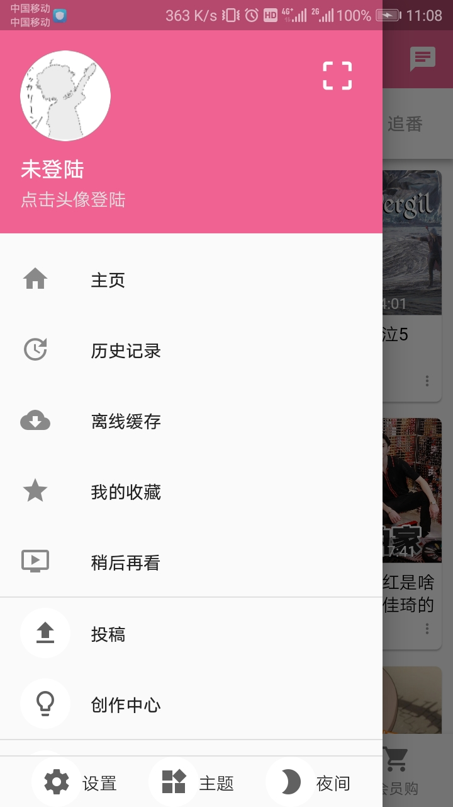

# flutter_MyBilibili
一个仿b站的flutter练习app

# 已经实现的功能
* 首页
	* 推荐-下拉刷新，加载更多
	* 直播-下拉刷新
* 搜索
	* 支持关键字和av号搜索
	* 热搜推荐
	* 历史纪录
* 播放界面，
	* 可以看到视频信息和评论（评论暂时只做了前面的热评和一些最新的评论）
* 频道
	* 获取实时频道列表
* 动态
	* 显示未登录
* 会员购
	* 下拉刷新，加载更多（后来由于可能会闪退去掉了加载更多）
* 侧边栏
	* 显示头像，昵称，等（见截图）
* 登陆
	* 简单的登陆界面，输入密码时候2233会遮住眼睛

# 获取方式

### 点击链接下载安装包
[下载](release/app-release.apk)

### clone本项目自行build

# 界面

|              描述                        |       预览                  |
| :----------------------------: | :-----------------------: |
|     主页面       |  |
|       推荐视频     |  |
|       直播     |   |
|      追番      |  |
|      我的      |  |
|      频道      |  |
|      动态      |  |
|      会员购      |  |
|      播放界面      |  |
|      搜索界面      |  |
|      搜索结果      |  |
|      登陆      |  |
|      输入密码      |  |

# TODO

* 搜索
	* 搜索记录
	* 热门推荐
	* 搜索输入推荐

* 附加功能
	* 封面保存

* 