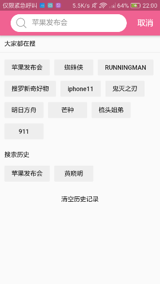

# flutter_MyBilibili

bilibili by flutter

这是一个高仿bilibili的flutter练习app

# 已经实现的功能
* 首页
	* 推荐-下拉刷新，加载更多
	* 热门top100下拉刷新，加载更多
	* 追番页面
	* 影视页面
	* 70周年页面
	* 直播-下拉刷新-**可以看直播啦**
* 搜索
	* 支持关键字和av号搜索
	* 热搜推荐和搜索记录
	* 支持按照默认/播放量/弹幕数/新发布排序
* 播放界面
	* **可以播放视频了！**
	* 可以看到视频信息和评论（评论暂时只做了前面的热评和一些最新的评论）
	* 点击右上角可以保存封面到相册
* 频道
	* 获取实时频道列表
* 动态
	* 显示未登录
* 会员购
	* 显示活动和商品列表
	* 下拉刷新，加载更多
* 我的
	* 显示头像，昵称、等
	* 设置界面
	* 简单登陆界面和彩蛋

# 界面

|              描述                        |       预览                  |
| :---------------------------- | :----------------------- |
|     启动页       |  |
|       推荐/直播     |   |
|       直播播放页面     |   |
|       热门列表     |   |
|       追番列表     |   |
|       影视列表     |   |
|       70周年     |   |
|       播放/评论页面     |   |
|     保存封面并查看    ||
|     搜索推荐/搜索记录/结果     |     |
|      搜索结果/筛选      |    |
|  登陆/输入密码|   |
|      频道/动态      |   |
|      会员购      |  |

# How to start

### 点击链接下载安装包
[下载](release/app-release.apk)

# TODO

- [x] 搜索
	- [x] 搜索记录
	- [x] 热门推荐
- [x] 番剧列表
- [x] 影视列表
- [x] 70周年列表
- [x] 热门动态
- [x] up主信息
- [x] 附加功能
	- [x] 封面保存

