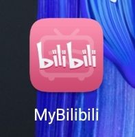

# flutter_MyBilibili
一个仿b站的flutter练习app

# 可以支持的功能
1. 首页-推荐-下拉刷新，加载更多
2. 首页-直播-下拉刷新
3. 搜索，支持关键字和av号搜索
4. 播放界面，可以看到视频信息和评论（评论暂时只做了前面的热评和一些最新的评论）
5. 频道-获取实时频道列表
6. 动态-显示未登录
7. 会员购-下拉刷新，加载更多（后来由于可能会闪退去掉了加载更多）
8. 侧边栏-头像，昵称，等（见截图）
9. 登陆-简单的登陆界面，输入密码时候2233会遮住眼睛

多图杀猫
# 界面截图

## 主页
 

## 频道

## 动态

## 会员购

## 播放

## 搜索

## 登陆

## logo

